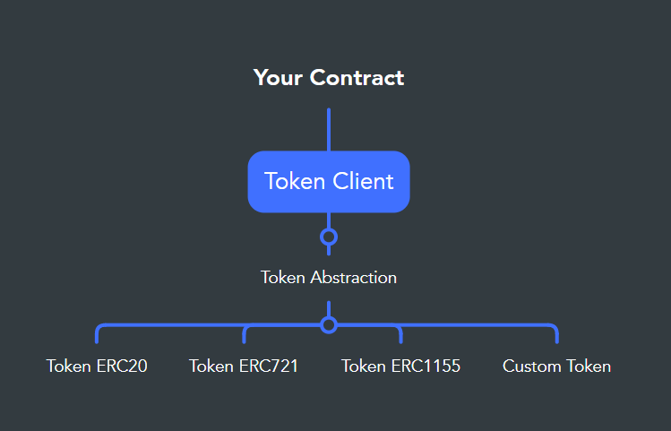

<h1 align="center">Token Client</h1> 
<p align="center">Generalizes operations with fungible and non-fungible tokens</p>
 
[TokenClient.sol](contracts/TokenClient.sol) is a smart contract that facilitates support for fungible and non-fungible token operations. It contains a set of [TokenAbstraction](contracts/TokenAbstraction.sol) implementations with read and transfer functions, such as [TokenERC20](contracts/concretes/TokenERC20.sol), [TokenERC721](contracts/concretes/TokenERC721.sol) or [TokenERC1155](contracts/concretes/TokenERC1155.sol), which are responsible for calling the functions of each standard and do not use storage. For the developer, TokenClient allows to generalize the functionality of its operations with tokens using the template pattern, and support new token standards using the proxy pattern.
 

<p align="center"></p>

The functionality of TokenAbstraction is basic due to the differences between standards, but is sufficient for many use cases. If needed, its implementations can wrap more functionality, as is the case of TokenERC721 that includes the owner method.

```solidity
function isStandard(address contractAddress) external view returns(bool);
function isOwner(Token calldata token, address account) external view returns (bool);
function isOwnerSet(TokenSet calldata tokenSet, address account) external view returns (bool);
function isApproved(Token calldata token, address account, address operator) external view returns (bool);
function isApprovedSet(TokenSet calldata tokenSet, address account, address operator) external view returns (bool);
function transfer(Token calldata token, address from, address to) external returns (bool);
function transferSet(TokenSet calldata tokenSet, address from, address to) external returns (bool);
```
The functionality uses the [Token](contracts/Token.sol) and [TokenSet](contracts/TokenSet.sol) structures. Token represents for fungibles a quantity of tokens while for non-fungibles it represents a single element. TokenSet represents for non-fungible tokens a set of unique elements. The token id is of type bytes32 instead of uint256 to support more powerful NFTs.

 ```solidity
struct Token
{
    bytes32 Standard;
    address Contract;
    bytes32 Id;
    uint256 Amount;  
}

struct TokenSet
{
    bytes32 Standard;
    address Contract;
    bytes32[] Ids;
    uint256[] Amounts;  
}
```
Example of use:

 ```solidity
// SPDX-License-Identifier: MIT
pragma solidity ^0.8.9;

import "https://github.com/DanielAbalde/TokenClient/blob/master/contracts/TokenClient.sol";

/*
    Simple buy/sell mechanism but potentially supports any standard

    This is how to suport ERC20, ERC721 and ERC1155:

    const tokenClient = await deploy("TokenClient");

    const tokenERC20 = await deploy("TokenERC20");
    const tokenERC721 = await deploy("TokenERC721");
    const tokenERC1155 = await deploy("TokenERC1155");
    
    await tokenClient.support(tokenERC20.address);
    await tokenClient.support(tokenERC721.address);
    await tokenClient.support(tokenERC1155.address); 
*/

contract ExampleOfUse
{
    struct Item
    {
        Token Token;
        uint256 Price;
        address Owner;
    }

    TokenClient private _client;
    mapping(uint256=>Item) private _items;
    uint256 private _itemCount;

    constructor(address tokenClient) {
        _client = TokenClient(tokenClient);
    }

    function sell(Token calldata token, uint256 price) external returns(uint256 id) {
        require(_client.isOwner(token, msg.sender), "Not the owner");
        require(_client.isApproved(token, msg.sender, address(_client)), "Not approved");
        require(price > 0, "Price is zero"); 
        id = ++_itemCount;
        _items[id] = Item(token, price, msg.sender);
    }

    function buy(uint256 id) external payable {
        Item memory item = _items[id];
        require(item.Owner != address(0), "id not found");
        require(msg.value >= item.Price, "Not enough value");
        payable(item.Owner).transfer(msg.value);
        _client.transfer(item.Token, item.Owner, msg.sender);
    } 
}
```