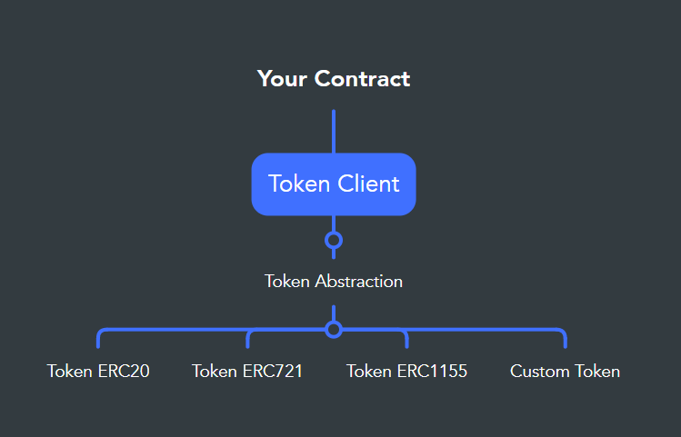

<h1 align="center">Token Client</h1> 
<h2 align="center">A token aggregattor to develop standard-agnositc mechanism</h2> 
<h3 align="center">Share functionality between ERC20, ERC721, ERC1155 or any token standard</h3>
<p align="center" style="font-style: italic">⚠️<small>Non-audited but open source contracts</small>⚠️</p>


## 🧐 Overview

[TokenClient.sol](contracts/TokenClient.sol) is a smart contract to support fungible and non-fungible token operations (such as sell/buy, swap, etc) in a generic way, making easy, quick, elegant, generic and future-proof implementations of token algorithms. You support the standards you want at any time, and instead of calling their functions, you call the client and this client refers the call to the method of the specific standard using [TokenAbstraction](contracts/TokenAbstraction.sol) instances. This way you can develop token operations  using the same code for all standards you want to support.

<p align="center"></p>
 
You can reference a TokenClient instance on your dapp or inherit from TokenClient contract. To support the standards you want, you have to register on the client some [TokenAbstraction](contracts/TokenAbstraction.sol) concrete, such as [TokenERC20](contracts/concretes/TokenERC20.sol), [TokenERC721](contracts/concretes/TokenERC721.sol) or [TokenERC1155](contracts/concretes/TokenERC1155.sol), which have a few view functions, the transfer function and doesn't have storage. These are in charge of calling the methods of each standard, but you only have to make calls to your TokenClient instance, using methods such as `isOwner`, `balanceOf`, `isApproved` or `transfer`. Then you can focus on the logic of your dapp without worrying about standards support, separating this decision from the implementation and allowing it to be defined at any time.

## 🌟 Features
- Easy to use, query and transfer any token from one instance.
- Quick to implement, focus on your contract logic and forget about standard specifications.
- Generic functionality, make your dapp operate generically with tokens.
- More elegant, reduces complexity and redundancy in your logic.
- Future-proof, your contract will be able to support any new token standard.
- Standard identification, recognize what type of token a contract address is.
- Transfer event, monitors when any token has been transferred.
- Call permission, controls from where the client can be called.
- Install as a package: `npm i @danielabalde/token-client`. 


## 🚀 Motivation

When you start a project that operated with NFT, such as swappers or marketplaces, you are faced with the dilemma of making the functionality specific to each standard or making it generic. In the first case it becomes a mess if you use proxies; and in the generic case there is extra work that each project has to do. In both cases, it makes sense to externalize this logic to save time and make it more elegant and advanced.

On the other hand, I am quite convinced that in a few years there will be new standards for NFT and fungible tokens, not only because of their current limitations, but also because replacing EOAs with contract-based accounts may improve the current patterns.

## ⚙️ Token functionality

The shared functionality between standards is enough to help marketplaces and operators in many use cases. It can be extended particullary, as is the case of [TokenERC721](contracts/concretes/TokenERC721.sol), where it includes the `owner()` function. Or you can extending it with a custom token operator by inheriting from [TokenAbstraction](contracts/TokenAbstraction.sol).

You can use [TokenClient.sol](contracts/TokenClient.sol) as an interface to have the same logic for any token standard you want to support. You can see the functionality in the following (note that is shown without function bodies for simplicity).

```solidity
// SPDX-License-Identifier: MIT
pragma solidity ^0.8.0;

import "./TokenAbstraction.sol"; 
import "@openzeppelin/contracts/access/Ownable.sol";
 
contract TokenClient is Ownable
{ 
    (...)

    event StandardSupported(bytes32 indexed standard);
    event StandardReplaced(bytes32 indexed standard, address indexed previous);
    event StandardUnsupported(bytes32 indexed standard);
    event TokenTransfered(Token indexed token, address indexed from, address indexed to);
    event TokenSetTransfered(TokenSet indexed tokenSet, address indexed from, address indexed to);

    function isStandard(address contractAddress) external view returns(bool);

    function isOwner(Token calldata token, address account) external view returns (bool);
    function balanceOf(Token calldata token, address account) external view returns (uint256);
    function isApproved(Token calldata token, address account, address operator) external view returns (bool);
    function transfer(Token calldata token, address from, address to) external returns (bool);
    
    function isOwnerSet(TokenSet calldata tokenSet, address account) external view returns (bool);
    function balanceOfSet(TokenSet calldata tokenSet, address account) external view returns (uint256[] memory);
    function isApprovedSet(TokenSet calldata tokenSet, address account, address operator)  external view returns (bool);
    function transferSet(TokenSet calldata tokenSet, address from, address to) external returns (bool);

    (...)
}
```
## 📦 Token data
 [Token](contracts/TokenData.sol) represents for fungibles a quantity of tokens, and for non-fungibles an identificable token. [TokenSet](contracts/TokenData.sol) represents for non-fungible a set of unique tokens. The token id is of type `bytes32` instead of `uint256` to support more powerful NFTs.

 ```solidity
struct Token
{
    bytes32 Standard;
    address Contract;
    bytes32 Id;
    uint256 Amount;  
}

struct TokenSet
{
    bytes32 Standard;
    address Contract;
    bytes32[] Ids;
    uint256[] Amounts;  
}
```
## 📖 Example
Define token support for ERC20, ERC721 and ERC1155 in a minimal buy/sell mechanism:


 ```js
    // using ethers.js and ./scripts/deploy.js

    const tokenClient = await deploy("TokenClient");

    const tokenERC20 = await deploy("TokenERC20");
    const tokenERC721 = await deploy("TokenERC721");
    const tokenERC1155 = await deploy("TokenERC1155");
           
    await tokenClient.support(tokenERC20.address);
    await tokenClient.support(tokenERC721.address);
    await tokenClient.support(tokenERC1155.address); 

    const market = await deploy("Market", tokenClient.address);
```

```solidity
// SPDX-License-Identifier: MIT
pragma solidity ^0.8.9;

import "@danielabalde/token-client/contracts/TokenClient.sol";

contract Market
{
    struct Item
    {
        Token Token;
        uint256 Price;
        address Owner;
    } 
   
    TokenClient _client;

    mapping(uint256=>Item) _items;
    uint256 _itemCount;

    constructor(address tokenClient) {
        _client = TokenClient(tokenClient);
    }

    function sell(Token calldata token, uint256 price) external returns(uint256 id) {
        require(_client.isOwner(token, msg.sender), "Not the owner");
        require(_client.isApproved(token, msg.sender, address(_client)), "TokenClient not approved by owner");
        require(price > 0, "Price is zero"); 
        id = ++_itemCount;
        _items[id] = Item(token, price, msg.sender);
    }

    function buy(uint256 id) external payable {
        Item memory item = _items[id];
        require(item.Owner != address(0), "id not found");
        require(msg.value >= item.Price, "Not enough value");
        payable(item.Owner).transfer(msg.value);
        _client.transfer(item.Token, item.Owner, msg.sender);
    } 
}
```

## 🔌 install with npm
```md
npm i @danielabalde/token-client
```

## 📌 Other projects using it:
- [Challenge To Claim](https://github.com/DanielAbalde/Challenge-To-Claim-Token). Put tokens under a challenge such as a quiz, whoever solves or finds the solution claims the tokens.


## ☕ Contribute 
* Issues and Pull Request on Github are welcome. 
* Invite me a coffee at daniga.eth or 0x4443049b49Caf8Eb4E9235aA1Efe38FcFA0055a1
* Share it on social media!
* Give a ⭐ to this project!